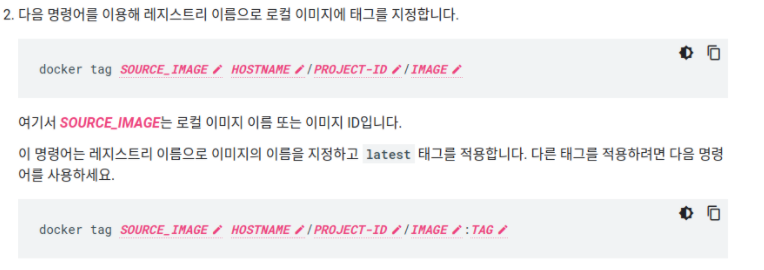
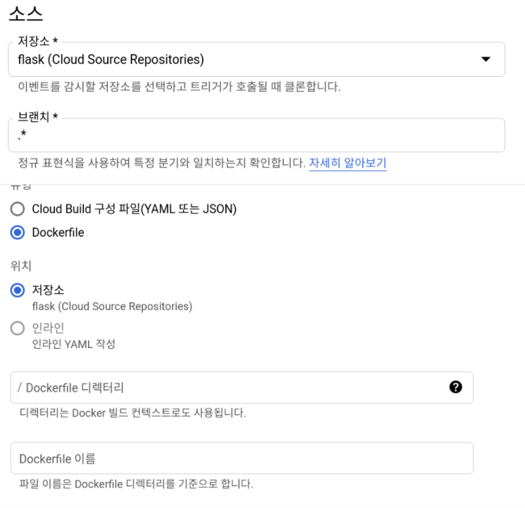

# GKE 사용
무료로 제공되는 cloud shell 사용한다   

쿠버네티스 엔진에 들어가서, 클러스터를 기본으로 구성(노드2개로 교체)

cloud shell에 클러스터 연결항목을 누르고 gcloud 명령어 복사해서 붙여넣으면 실행된다

위치유형을 영역으로 만들어야 원하는 노드개수 그대로 클러스터 구성된다.

스토리지클래스, pv, pvc, 인그레스, 워드프레스 ,hpa 구성하여 스케일링하고 노드개수 늘려보기

디플로이 생성시에 메모리 리미트를 크게주면 노드 늘어남 == cluster autoscaling

디플로이먼트 이용해서 GCP의 Cloud Registry를 이용하여 이미지 풀링 해보기

온프레미스 환경에서 secret을 통해 ImagePullSecret 제공하였는데 gcp에서는 그럴 필요없다. 위의 tagging 과정만 지켜주고 그대로 이미지를 푸시해주면 GCP의 레지스트리에 올라간다.   

# CI/CD
python code ---push ==> Git   
---build ==> Docker image --- push ==> Registry ---deploy ==> kubernetes 배포   

이미 수동으로 위의 과정을 모두 진행해보았고, GCP를 통해 자동화하여 진행해본다
1. CI: Continous Integration   
    python code ---push ==> Git 
    ---build ==> Docker image --- push ==> Registry   

    **목적은 코드를 수정하고 push만 해주면 도커파일을 읽어 빌드하고 그것을 레지스트리에 올려주는 것**   

    Docker Hub: Autobuild\
    GitLab: CI/CD\
    Github: Action   

    (1) cloud source repogitories 에서 레포지토리 새로생성   
    (2) 명령어 정해준대로 수행, gcloud 사용
    (3) CI에 사용할 Dockerfile과 flask python file, requirements.txt 파일들을 git clone 명령어를 통해 가져온 디렉토리에 mv 해준다.   
    (4) git push -u origin master 하면 클라우드 소스 레포에 올라간다

    (5) 이것을 CI 하자 push하면 자동으로 도커파일을 읽어 이미지를 빌드하고 그것을 다시 레지스트리에 푸시하는 것을 자동으로..   

    

    * 작업순서   
     **cloud source repo 저장소 생성! -> cloud build 에서 도커파일 트리거 설정!(브랜치로 push 할 때 트리거 발생) -> container registry에서 컨테이너 이미지 확인!**   
     
    디렉토리 경로는 저장소의 경로를 말한다,    
    도커파일 이름은 기본으로 설정   
    
    (6) 확인   
    cloud shell에서 클론해온 디렉토리내의 파일 아무거나 수정하고  
    add commit push 진행 ==> 도커빌드되고, 컨테이너 레지스트리에 올라간다.

2. CD: Continuos Delivery/Deployment   

    CD docs   

    [https://cloud.google.com/kubernetes-engine/docs/tutorials/gitops-cloud-build?hl=ko-KRLTE](https://cloud.google.com/kubernetes-engine/docs/tutorials/gitops-cloud-build?hl=ko-KRLTE)   

GCP에는 elastic stack, grafana 등처럼 모니터링 도구가 이미 있다    
kubernetes 엔진 메뉴 오른쪽위의 operation에서 측정항목 보기를 통해 모니터링확인 할 수 있다 

나의 클러스터에 대한 권한을 다른 유저가 읽기권한을 갖게끔 IAM설정   
클러스터 뷰어권한   
\
\
**cluster role 오브젝트에서 선언해줬던 종류와 정확히 매칭이된다.**
cluster-admin(슈퍼유저)   
admin(롤, 롤바인딩에 대한 권한 X)   
edit(리소스에 대한 읽기/쓰기 권한 but 롤, 롤바인딩은 안된다.)   
view(읽기 권한만 갖는다)

